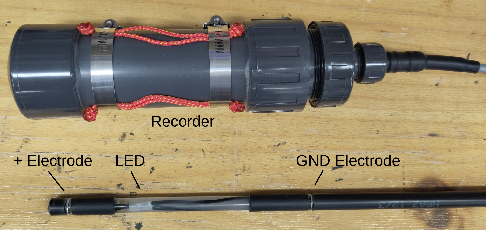
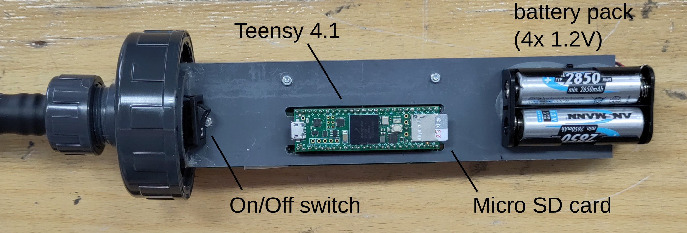
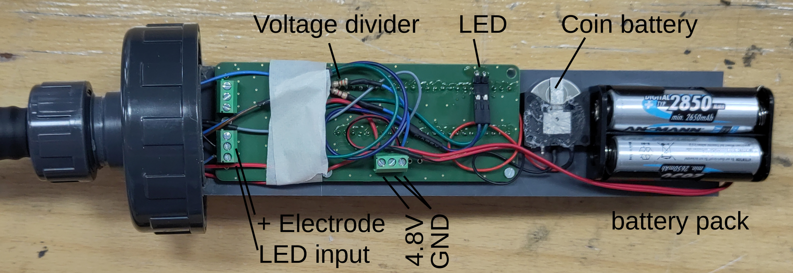
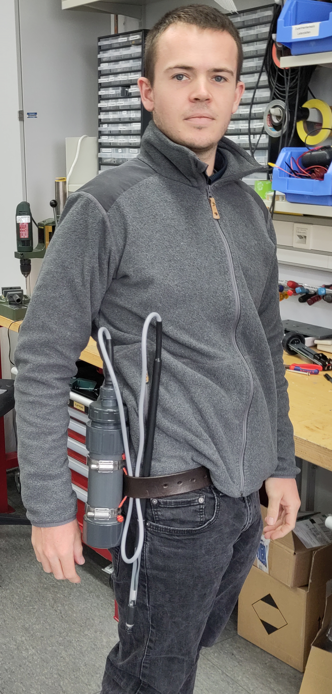
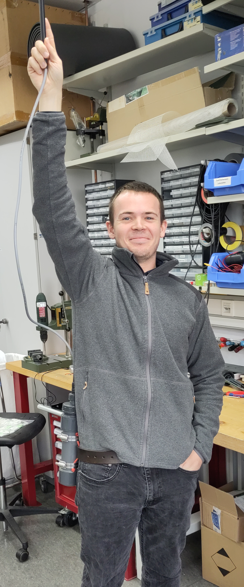

# R4.2 fishrecorder

A recorder for a single channel based on [Teensy_Amp
  R4.2](https://github.com/janscience/Teensy_Amp/tree/main/R4.2)
  connected to a [Teensy
  4.1](https://www.pjrc.com/store/teensy41.html) which generates random sequence of LED blinks for synchronization with a video camera.

Software designed by Jan Benda, hardware by Patrick Weygoldt in October 2023.

The fishrecorder in its waterproof PVC housing and the electrode with
the LED for synchronization with the video recording.

Inside we see the Teensy microcontroller with the micro SD card on
which the recorded data are stored, the on/off switch, and the 2 of
the 4 AA-batteries.

On the other side we see the backside of the amplifier PCB - an
  [Teensy_Amp
  R4.2](https://github.com/janscience/Teensy_Amp/tree/main/R4.2). It
  drives the LED (top right connector). THe LED signal is attenuated
  by a factor of about 10 by means of a voltage divider (330 Ohm, top,
  and 4.7kOhm, bottom). This attenuated LED signal is recorded by the
  amplifier (blue wire) together with the electrode signal (black
  wire, bottom left screw terminal). The bottom screw terminal
  receives battery power (red and black wires), and all the grounds
  from the electrode, LED, and voltage divider. The coin battery
  drives the real-time clock of the Teensy.

## Handling

The fishrecorder can be mounted on your belt and the electrode cable
is just long enough for your stretched arm.

## Usage

1. Open the housing by unscrewing the lid.

2. Check the batteries, there should be 4.8V or more between the red
   and the black wire connected to the battery pack. If less, you need
   to charge the batteries.

   Be careful when exchanging batteries! Try to keep the
   short-circuited negative poles intact. Make sure you see the 4.8V
   between the wires. Or switch on the recorder and check whether the
   LED starts blinking.

3. Switch on the recorder via the on/off switch. The "1" needs to be
   pressed down. The LED in the electrode should light up. If not,
   check the batteries and the wiring of the battery holder.

4. First, the LED is on for about 2 seconds. Then it produces a few
   double blinks for 10 seconds. With 5 short blinks the recorder then
   indicates that it openend its first file and is recording. The LED
   then blinks with random intervals and durations. Every 5 minutes a
   new file is opened as indicated by another series of 5 blinks.

5. Close the recorder by screwing the housing on the lid. Make sure
   the O-ring is still in the lid. The recorder keeps recording.

6. Mount the recorder on your gear and go diving.

7. When recording a fish, point the electrode to the fish and make
   sure you have the blinking LED on the video. This way we can later
   on synchronize the electrode recording with the video.

8. When you are done, open the recorder and switch it off.

9. Take the SD card out and download the wave files from the
   `recordings/` directory onto your computer.

10. Remove all files from the SD card and put the SD card back into
    the recorder.
