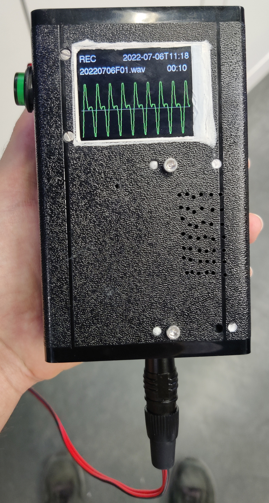
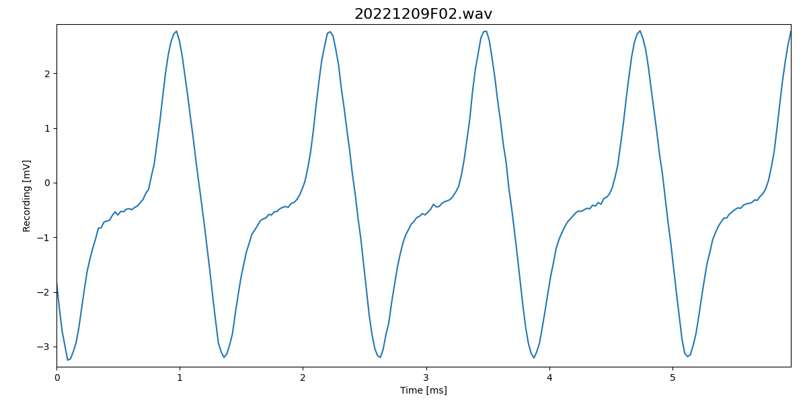

# FishFinder

Smart fishfinders for better EOD recordings of electric fish in the field.

## Features

- Audio monitor plays back the recorded signal - that's what every
  fishfinder does.
- A display shows the recorded signal.
- Record directly to SD card.
- Voice message: after a recording you can record a voice message for
  some meta data.
- Download recordings and voice messages over USB connector via MTP.
- Audio feedback: indicate clipping by warning tones.
- Indicate peak frequency of power spectrum on display.
- LiPo battery rechargeable with 5V via micro USB plug.
- Run fishfinder as logger for continuous recordings
  (with display and audio monitor disabled).

## Installation and Usage

- [Installation instructions](docs/install.md)
- [User manual](docs/usage.md)

## Sketches

Current version of the fishfinder software:

- [fishfinder](fishfinder/)

EOD waveform generator:

- [eods](eods/)

## Power consumption

Without amplifier:

|           | Voltage | Current | Power | Runtime 2Ah |
| :-------- | ------: | ------: | ----: | ----------: |
| running   |    3.7V |   114mA | 420mW |         15h |
| recording |    3.7V |   136mA | 505mW |       12.5h |
| running   |      5V |   145mA | 720mW |        8.5h |
| recording |      5V |   153mA | 770mW |          8h |

The last colum is the run time to be expected for a 2Ah battery
assuming an efficiancy of 85%: for the 3.7V LiPo it is 2Ah times times
85% efficiancy divided by current, for the 5V power bank it is 2Ah
times 3.7V LiPo voltage divided by 5.1V output voltage times 85%
efficiancy (=0.62) divided by current.

## Documentation

- [Usage](docs/usage.md)
- [Fishfinder electrodes](docs/electrodes.md)
- [Hardware](docs/hardware.md)

