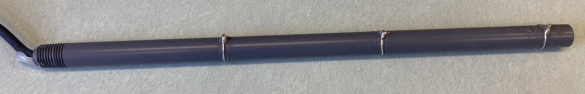

# Fishfinder Electrodes

Different types of fishfinder electrodes are used. Some with two
electrodes and some with three electrodes. They differ in their
spatial characteristics strength of the signal during saerching and
recording and in their ability to suppress common noise.

We must consider two situations:

1. Searching phase: the fishfinder is in one of the lobes of the
   fish's dipole field.
2. Recording phase: you are (hopefully) close and in parallel to the
   fish with one electrode near the head and the other one near the
   tail.

## Dipole fishfinder

R&uuml;diger Krahe style.

A voltage is recorded between two electrodes resulting in a single
channel with dipolar characteristics.

## Stereo fishfinder

Hopkins/Sullivan style.

Three electrodes. The middle one is the reference against which the
front and the back electrode are measured. Results in two channels
each with a dipolar characteristics.  See [How to build wand
electrodes and fish finder
schematics](https://mormyrids.myspecies.info/en/node/473)

It depends on how you use those two channels:

- Just sum them up. This most-likely happens if you plug this into a
  mono-amplifier. This is really bad during the search phase, because
  the signals on both channels differ in sign. During recording phase,
  the sum of both channels result in the same signal as from the
  dipole fishfinder. In both contexts, common noise and hum is
  canceled out, because it is picked up with opposite signs by the two
  channels.
  
- Subtract them. Same search properties as dipole fishfinder. Really
  bad for recording. This configuration is not an option.

- Record them both.

## 2-channel dipole fishfinder

Jan Benda style.

Same hardware as the dipole fishfinder, but each electrode is measured
against a far away common ground.

## Comparison

|                                   | Dipole fishfinder | Stereo fishfinder | 2-channel dipole |
| --------------------------------- | ----------------- | ----------------- | ---------------- |
| Spatial characteristics           | Dipole            | Dipole            | Monopole         |
| Sensitivity during searching      | Good              | Weak              | Best             |
| Noise supression during searching | None              | Good              | None             |
| Indication of head-tail recording | No                | No                | Yes              |
| Sensitivity during recording      | Good              | Good              | Good             |
| Noise supression during recording | None              | Yes               | None             |
