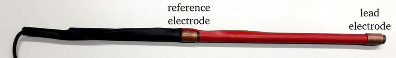

# Fishfinder Electrodes

Different types of fishfinder electrodes are used. Some with two
electrodes and some with three electrodes. They differ in their
spatial characteristics, strength of the signal during saerching and
recording and in their ability to suppress common noise.

We must consider two situations:

1. Searching phase: the fishfinder is in one of the lobes of the
   fish's dipole field.
2. Recording phase: you are (hopefully) close and in parallel to the
   fish with one electrode near the head and the other one near the
   tail.

## Dipole fishfinder

The dipole fishfinder can be used in two configurations:

1. Single-channel that records the voltage between the lead and the
   reference electrode.  Results in dipolar characteristics
   ([R&uuml;diger
   Krahe](https://www.biologie.hu-berlin.de/en/groupsites/vhphysiol)
   style).

2. Two-channels that record each of the two electrodes against a far
   away common ground ([Jan Benda](https://bendalab.github.io/) style).
   During the recording phase one would subtract the two channels.

## Stereo fishfinder

Hopkins/Harned/Sullivan style.

Three electrodes. The middle one is the reference against which the
front and the back electrode are measured. Results in two channels
each with a dipolar characteristics.  See [How to build wand
electrodes and fish finder
schematics](https://mormyrids.myspecies.info/en/node/473) on
[Mormyridae - African weakly electric
fishes](https://mormyrids.myspecies.info) by [John
Sullivan](https://mormyrids.myspecies.info/en/user/175).

It depends on how you use those two channels:

- Just sum them up. This most-likely happens if you plug this into a
  mono-amplifier. This is really bad during the search phase, because
  the signals on both channels differ in sign. During recording phase,
  the sum of both channels result in the same signal as from the
  single-channel dipole fishfinder. In both contexts, common noise and
  hum is canceled out, because it is picked up with opposite signs by
  the two channels.
  
- Subtract them. Same search properties as dipole fishfinder. Really
  bad for recording. Therefore, this configuration is not an option.

- Record them both as two channels.

## Comparison

| Fishfinder type:                  | 1-channel dipole  | 2-channel dipole | Stereo sum (1-channel) | 2-channel stereo |
| --------------------------------- | ----------------- | ---------------- | ---------------------- | ---------------- |
| Spatial characteristics           | Dipole            | **Monopole**     | Dipole                 | Dipole           |
| Sensitivity during searching      | Good              | **Best**         | Very weak              | Weak             |
| Noise supression during searching | No                | No               | **Yes**                | No               |
| Indication of head-tail recording | No                | **Yes**          | No                     | No               |
| Sensitivity during recording      | Good              | Good             | Good                   | Good             |
| Noise supression during recording | None              | None             | **Yes**                | **Yes**          |
