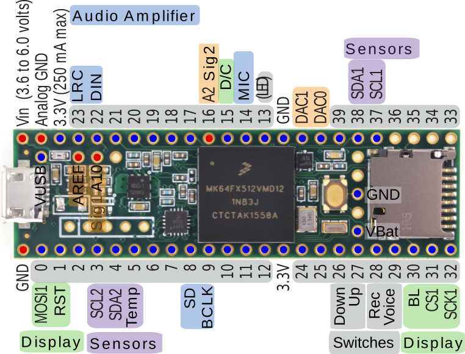

# Hardware

- Amplifier: [Teensy_Amp
  R3.0](https://github.com/janscience/Teensy_Amp/tree/main/R3.0)
- Microcontroller: [Teensy 3.5](https://www.pjrc.com/store/teensy35.html)
- Battery charger: [Adafruit LiIon/LiPoly
  Backpack](https://www.adafruit.com/product/2124)
- Battery (below the PCB): [3.7V 2000mAh Lithium Polymer
  Akku](https://www.exp-tech.de/zubehoer/batterien-akkus/lipo-akkus/6329/3.7v-2000mah-lithium-polymer-akku-mit-jst-ph-anschluss?c=1191)
- Audio amplifier: [Adafruit MAX98357 I2S Class-D Mono
  Amp](https://learn.adafruit.com/adafruit-max98357-i2s-class-d-mono-amp)
- Speaker: [Adafruit mono enclosed speaker
  3W](https://www.adafruit.com/product/3351)
- Display: [Adafruit 2.0" 320x240 Color IPS TFT
  Display](https://www.adafruit.com/product/4311)
- Microphone: [SparkFun Analog MEMS
  Microphone](https://www.sparkfun.com/products/18011)
- USB micro connector: [TRU components 1365796](https://www.conrad.de/de/p/micro-usb-einbaubuchse-2-0-buchse-einbau-micro-usb-01-micro-usb-buchse-auf-micro-usb-stecker-1365796-tru-components-inh-1365796.html)
- Mono jack socket 6.3mm: [BKL Electronic 1109030](https://www.conrad.de/de/p/bkl-electronic-1109030-klinken-steckverbinder-6-35-mm-buchse-einbau-vertikal-polzahl-num-2-mono-silber-1-st-732761.html)
- Mono jack 6.3mm: [Hicon HI-J63MP-B](https://www.conrad.de/de/p/hicon-hi-j63mp-b-klinken-steckverbinder-6-35-mm-stecker-gerade-polzahl-num-2-mono-schwarz-1-st-1541221.html)
- Banana socket: [Schützinger IBU 5568](https://www.conrad.de/de/p/schuetzinger-ibu-5568-ni-sw-einbaubuchse-schwarz-1-st-2342971.html)
- Coin battery holder: [TRU components CH26-2032LF](https://www.conrad.de/de/p/tru-components-ch26-2032lf-knopfzellenhalter-1x-cr-2032-kontaktpole-1672595.html)
- On/off switch: [TRU components Wippschalter R13-112A-02](https://www.conrad.de/de/p/tru-components-wippschalter-r13-112a-02-bb-on-off-250-v-ac-6-a-1-x-aus-ein-rastend-1-st-1565960.html)
- Volume up/down switch: [Marquardt Wippschalter 1838.1402](https://www.conrad.de/de/p/marquardt-wippschalter-1838-1402-250-v-ac-6-a-1-x-ein-aus-ein-ip40-tastend-0-tastend-1-st-704284.html)
- Record button: [TRU components TC-R13-523AL-05RT](https://www.conrad.de/de/p/tru-components-tc-r13-523al-05rt-drucktaster-250-v-ac-1-5-a-1-x-aus-ein-tastend-rot-1-st-1587753.html)
- Voce-message button: [TRU components TC-R13-523AL-05GN](https://www.conrad.de/de/p/tru-components-tc-r13-523al-05gn-drucktaster-250-v-ac-1-5-a-1-x-aus-ein-tastend-gruen-1-st-1587807.html)
- Housing: [63000-510-000 CM3-150 Black Kit](https://www.mouser.de/ProductDetail/616-63000-510-000)

## Pinout

### Amplifier

A2, A10

### Display

On SPI1:

- MOSI1: 0
- D/C: 10
- RST: 1
- SCK1: 32
- CS1: 31
- BL: 30

- GND
- 3.3V

### Audio amplifier:

- LRC: 23
- BCLK: 9
- DIN: 22
- GAIN: GND
- SD: 7

- GND
- 3.3V

### Switches

- Volume down: 26
- Volume up: 27
- Record: 28
- Voice message: 29

### LEDs

Connect LEDs to 150Ohm resistances.

- Record: 11
- Voice: 12
