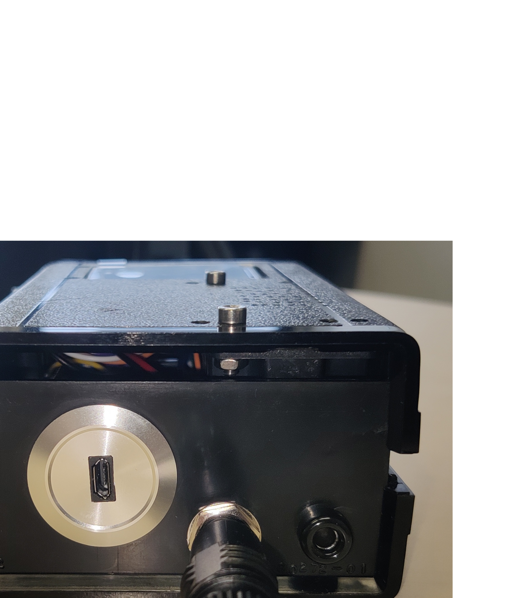

# Usage

## Inputs

## Preparation

1. Make sure the battery is charged by connecting the USB input to a
   5V source (USB on your computer or charger).
2. Plug in the fishfinder electrodes into the mono jack socket.

## Operation

1. Switch it on with the on/off switch.
2. Find a fish. You may adjust the audio volume via the volume up/down button.
3. Press the red record button to start a recording. During the
   recording a blinking "REC" on the display indicates the ongoing
   recording, the file name and the current duration of the recording
   in seconds are displayed.
4. To stop the recording press the record button again (try to record at
   least for 10s).
5. Press the green voice button to start recording a voice message.
6. Press the voice button to stop recording the voice message.
7. Find and record the next fish.
8. Switch the fishfinder off via the on/off switch.

## Switches

### Red record switch

- Start a recording.
- Stop a recording or voice message.
- Within 30s after a recording was stopped (as long as the filename
  is shown on the display): disable voice message and reactivate
  base screen.
    
### Green voice message switch

- Within 30s after a recording was stopped (as long as the filename
  is shown on the display): start and stop a voice message.
- after 30s of a recording or voice message:
  - brief push: toggle between volume (`V` indicator on top right of
    display), zoom time window (`X` indicator on top right of display),
    and zoom signal amplitude (`Y` indicator on top right of display).
  - push for minimum half a second: toggle audio feedback beeps on
    clipping (`C` indicator on top right of display).
      
### Blue volume switches

- increase or decrease audio volume (`V` indicator on top right of display)
- zoom time axis in or out (`X` indicator)
- zoom amplitude in or out (`Y` indicator)

## Get the data

- Open the fishfinder
- Take out the SD card
- Copy the data from SD card to your computer
- Remove all files from SD card
- Insert SD card back onto Teensy
- Close fishfinder housing.
